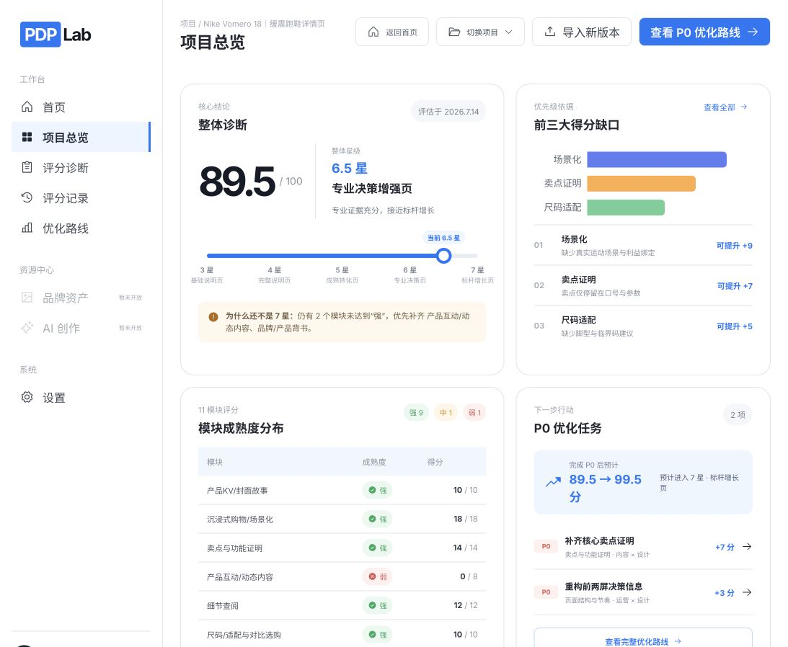
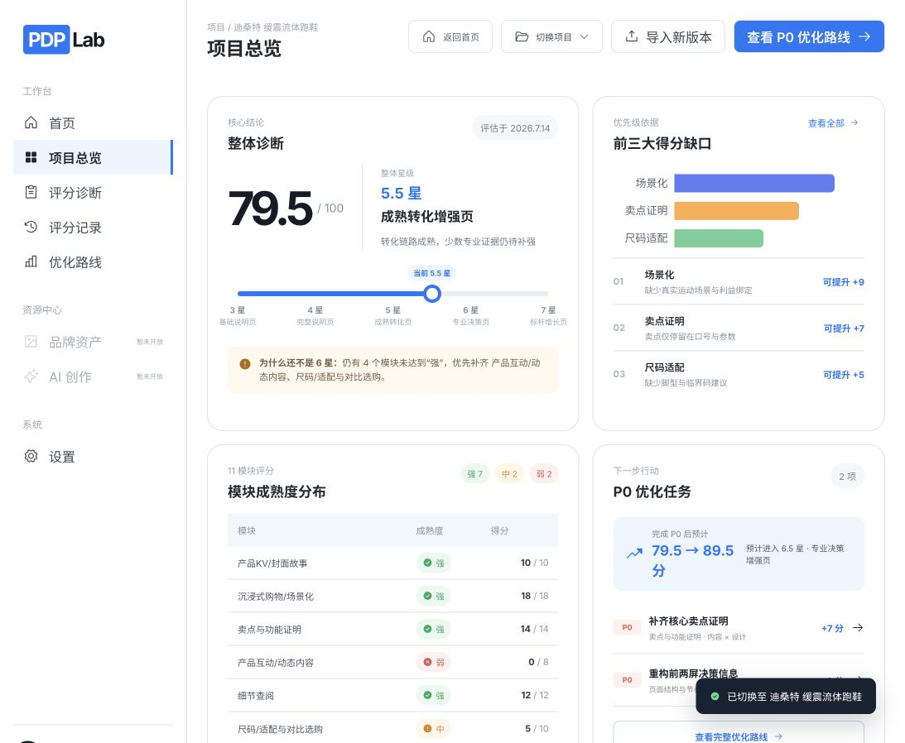

# 项目总览「得分缺口」逻辑核查

> 核查日期：2026-07-14  
> 页面：`http://127.0.0.1:4173/`  
> 视口：1093 × 898  
> 原始核查结论：卡片展示错误，仍为静态占位数据，未绑定当前项目评分模块。该问题已在本轮修复，修复结果见文末。

## 证据截图

### 1. Nike Vomero 18



页面显示“场景化 +9、卖点证明 +7、尺码适配 +5”，但该项目实际模块中场景化、卖点证明和尺码适配均为“强”且已获得满分，不应进入缺口列表。

### 2. 迪桑特缓震流体跑鞋



切换项目后，卡片仍显示完全相同的“场景化 +9、卖点证明 +7、尺码适配 +5”，进一步证明内容没有随当前诊断变化。

## 当前实现问题

1. `src/App.jsx` 中 `gapData` 固定为场景化 9、卖点证明 7、尺码适配 5。
2. 三条原因文案是固定数组，没有读取模块 `judgment` 或证据内容。
3. 图表和值列表均使用同一静态 `gapData`，切换项目不会重新计算。
4. 图表数值域固定为 `0–10`；若某个 18 分模块为弱，18 分缺口会超出图表量程。
5. Tooltip 写着“点击进入证据详情”，但图表本身没有点击交互，形成错误的操作暗示。

## 正确计算逻辑

```text
模块缺口 = 模块满分 max − 当前得分 score
候选模块 = 缺口 > 0 的模块
排序 = 缺口降序；同分时弱优先于中，再按评分规则模块顺序
展示数量 = 最多 3 项，不足 3 项时按实际数量展示
原因 = 当前模块 judgment；优先使用相应 evidence reason / OCR 摘要
图表上限 = 当前最大缺口，不能固定为 10
```

单模块只展示成熟度“弱 / 中 / 强”，不使用星级；整体星级仍只属于整页。

## 按当前数据应显示

### Nike Vomero 18｜89.5 分 / 6.5 星

| 排名 | 模块 | 成熟度 | 当前得分 | 可提升 | 依据 |
|---:|---|---|---:|---:|---|
| 1 | 产品互动/动态内容 | 弱 | 0 / 8 | +8 | 静态长图，未观察到视频、AR、3D或动效 |
| 2 | 品牌/产品背书 | 中 | 2.5 / 5 | +2.5 | 有 KOL 与消费者荐言，但缺少认证、奖项或科技来源 |

该项目只有 2 个真实缺口，不应为了凑满“三项”展示已满分模块。

### 迪桑特 缓震流体跑鞋｜79.5 分 / 5.5 星

| 排名 | 模块 | 成熟度 | 当前得分 | 可提升 | 依据 |
|---:|---|---|---:|---:|---|
| 1 | 产品互动/动态内容 | 弱 | 0 / 8 | +8 | 静态图片，缺少视频、AR、3D或动效 |
| 2 | 使用说明/服务事项 | 弱 | 0 / 5 | +5 | 未观察到护理、退换、售后说明 |
| 3 | 尺码/适配与对比选购 | 中 | 5 / 10 | +5 | 有尺码表和适穿场景，缺少脚型、版型与荐言 |

## 交互与无障碍核查

- 卡片结构、文字层级和颜色区分清楚，条形图外仍有文本列表，不依赖颜色单独传达信息。
- “查看全部”可以作为进入完整优化路线的入口，但需要确保目标页读取相同的动态缺口排序。
- 若保留“点击进入证据详情”提示，条形、列表项和键盘焦点都必须可点击；否则应移除该提示。
- 缺口为空时需要明确空状态，例如“11 个模块均已达到强，暂无评分缺口”。

## 核查步骤与健康度

1. 打开 Nike Vomero 18 项目总览：整体评分读取正确，缺口卡片错误。
2. 将缺口卡片与该项目 11 模块数据逐项对照：不一致，3 个展示模块均为满分强项。
3. 切换到迪桑特项目：整体评分与成熟度变化，缺口卡片仍完全不变。
4. 对照 PDP 评分规则复算缺口：可由 `max - score` 得到稳定、可解释的动态结果。

## 建议修复范围

- 仅修改项目总览缺口卡片的数据派生与文案绑定，不改评分规则、后端模型结果、页面布局或视觉规范。
- 同步复核 P0 优化任务卡；该区域当前也仍引用静态 `tasks`，可能与真实缺口不一致。

## 修复结果（2026-07-14）

- 已删除静态 `gapData` 与静态任务数据，项目总览、原因说明、P0 卡和完整优化路线统一由当前诊断模块派生。
- Nike Vomero 18 现显示 2 个真实缺口：动态内容 `+8`、品牌背书 `+2.5`；P0 后预计 `89.5 → 100`。
- 迪桑特现显示动态内容 `+8`、服务事项 `+5`、尺码适配 `+5`；P0 后预计 `79.5 → 92.5`。
- 图表量程根据当前最大缺口计算；缺口为空时有明确空状态；Tooltip 已移除不存在的点击暗示。
- “为什么还不是 X 星”、前三大缺口、P0 任务和完整路线使用同一排序来源，不再相互矛盾。
- 1093 × 898 下两项目卡片均无内部溢出，新页面控制台无错误。

修复后证据：

- `../design-qa-gap-panel-nike.png`
- `../design-qa-gap-panel-descente.png`
- `../design-qa-all-project-cards.png`

最终状态：已修复并通过浏览器验收。
