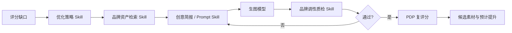

# PDP Lab Skill、模型与工作流管理方案

## 1. 结论

当前产品应将“评分规则”“模型连接”“能力编排”拆成三个独立层级：

1. **Skill 决定业务方法和输出契约**：PDP 评分、证据切片、优化建议、品牌匹配、提示词生成、素材质检。
2. **模型提供执行能力**：文本、视觉理解、生图、OCR、Embedding，不直接决定最终业务规则。
3. **Pipeline 负责组合能力**：定义先后顺序、输入输出、失败策略、人工节点和产物去向。

本次优先发布的 `pdp-v5` 继续作为正式评分基线。后续新增能力不应直接修改已发布版本，而应创建新版本、完成回归测试后再原子切换。

## 2. 当前准备情况

已具备：

- 异步诊断任务、Celery Worker、任务进度与失败提示。
- 11 模块评分、五级成熟度、T2/T1/T0 视觉层级、证据硬门槛。
- AI 模型与 PDP Skill 独立配置入口。
- 评分版本锁定、历史记录和人工修订。
- 页面证据、切片、缩略图与完整证据查看。
- GitHub Actions 生产发布和回滚基础。

仍需补齐：

- Skill 包导入、校验、版本差异、灰度与一键回滚。
- 多模型能力标签、连通性测试、费用/限额和路由优先级。
- Pipeline 可视化编排及每一步产物追踪。
- 标准回归案例集、输出稳定性阈值和发布门禁。
- 生图产物、品牌资产、质检结果的统一资产模型。

## 3. 后台信息架构

### 3.1 Skill 管理

独立菜单“能力中心 / Skills”，包含：

- Skill 列表：名称、用途、版本、状态、输入输出 Schema、风险等级、最近验证时间。
- 版本详情：规则正文、代码/配置摘要、来源哈希、依赖模型能力、变更说明。
- 导入方式：ZIP/JSON 包、Git 仓库版本、远程 HTTP/MCP Endpoint。
- 发布流程：草稿 → 校验通过 → 回归通过 → 待发布 → 已启用 → 已停用。
- 操作：复制版本、差异对比、灰度测试、启用、回滚、停用。

Skill 导入必须先进入暂存区，不可直接替换线上版本：

```text
导入 → 校验清单/Schema/签名 → 生成差异 → 跑基准案例
    → 创建非激活版本 → 超级管理员确认 → 原子切换 → 保留回滚点
```

### 3.2 模型管理

独立菜单“模型中心”，每个配置包含：

- Provider、协议、Base URL、模型名、加密凭证、超时、并发、重试。
- 能力标签：`text`、`vision`、`image_generation`、`ocr`、`embedding`、`structured_json`。
- 使用范围：允许哪些 Skill / Pipeline 调用。
- 路由优先级、备用模型、最大输入、费用预算和每日限额。
- 三级验证：纯文本、单张小图、结构化 JSON；生图模型另加尺寸和风格测试。
- 状态：未验证、可用、降级、不可用，显示最近错误和追踪 ID。

模型 Key 只保存加密密文；配置 API、日志和前端均不得返回明文。

### 3.3 工作流管理

独立菜单“工作流 / Pipelines”，首批预置三个工作流：

1. `PDP 诊断评分`
2. `PDP 优化与生图`
3. `品牌素材质检`

每个节点选择 Skill 版本和所需模型能力，而不是写死具体模型。Pipeline 发布后同样不可原地修改，只能创建新版本。

### 3.4 测试与发布中心

- 基准案例集：品类、品牌、长图、期望证据、期望区间、人工金标。
- 稳定性：同一输入多次运行，监控总分、模块系数和证据漂移。
- 对比报告：候选 Skill/模型与当前生产版本的逐模块差异。
- 发布门禁：Schema 100% 通过；硬门槛无退化；分数漂移在设定阈值内；失败率和延迟达标。
- 审计：谁在何时导入、测试、启用、回滚了哪个版本。

## 4. 推荐数据模型

| 对象 | 关键字段 |
| --- | --- |
| `SkillDefinition` | code、名称、用途、风险等级 |
| `SkillVersion` | version、manifest、input/output schema、source hash、状态 |
| `ModelProfile` | provider、protocol、model、capabilities、secret reference、limits |
| `PipelineDefinition` | code、名称、业务场景 |
| `PipelineVersion` | nodes、edges、fallback policy、状态 |
| `PipelineRun` | 输入、节点状态、追踪 ID、耗时、成本、最终状态 |
| `Artifact` | 类型、文件、来源节点、版本谱系、审核状态 |
| `EvaluationSet` | 案例、金标、允许偏差 |
| `ReleaseRecord` | 发布对象、前后版本、操作人、回滚点 |

所有诊断和素材产物必须保留：

```text
skill_version + model_profile_version + prompt_version
+ scoring_standard_version + source_hash + trace_id
```

这样才能解释“为什么本次得分或图片与之前不同”。

## 5. 多 Skill 配合逻辑

### 5.1 诊断评分


模型负责理解图片并返回结构化候选证据；PDP Skill 负责判定方法；后端策略层负责系数离散化、KV/场景硬门槛和最终总分。模型不得直接写入最终分数。

### 5.2 优化与生图



建议将生图设置为候选产物，不直接覆盖项目。用户确认采用后才进入正式版本。

### 5.3 品牌素材质检

质检至少输出：

- 品牌色、字体、构图、人物、产品露出、语气、禁用项匹配度。
- 证据定位和不通过原因。
- 可自动修正项与必须重新生成项。
- 所用品牌规范版本和模型版本。

## 6. 失败、降级与安全策略

- 每个节点独立超时、重试和幂等键。
- 模型不可用时只允许切换到已验证且能力等价的备用模型。
- 评分链路禁止静默 Mock；失败必须明确提示，不生成虚假分数。
- 生图失败可保留前序简报和 Prompt，允许从失败节点重试。
- 高风险 Skill、远程 Endpoint 和新权限必须经过管理员确认。
- 日志记录摘要、哈希、耗时和错误码，不记录 Key、完整隐私内容。

## 7. 分阶段实施

### P0：稳定评分（本次）

- 发布 `pdp-v5` 最新评分规则。
- 保留旧版本，新增 Skill 来源哈希和视觉规则元数据。
- 完成回归测试、迁移、生产健康检查与回滚点。

### P1：后台管理基础

- Skill 列表、版本详情、导入暂存、Schema 校验、差异和回滚。
- 模型能力标签、三级连通测试、主备路由和调用审计。
- 标准案例集与对比报告。

### P2：多 Skill 编排

- Pipeline 版本、节点运行状态、产物谱系、失败节点重试。
- 接入 OCR、品牌资产检索、优化策略和质检 Skill。

### P3：生图闭环

- 创意简报、Prompt、多个候选图、品牌质检、自动复评分。
- 人工采用/驳回、版本归档、优化前后对比和成本指标。

## 8. 建议确认的产品决策

1. Skill 发布权限仅限超级管理员，还是允许组织管理员发布到本团队？
2. 生图默认生成几张候选、单次预算和失败重试次数。
3. 品牌质检未通过时自动重生，还是先展示失败原因由用户确认。
4. 模型主备切换是否允许跨 Provider，以及允许的成本上限。
5. 标准案例集由平台统一维护，还是支持每个团队增加私有金标。

推荐默认：平台管理员发布公共 Skill；团队只能管理私有品牌规则和案例；质检失败先展示原因并允许一键重生；跨 Provider 降级必须满足能力和预算约束。
